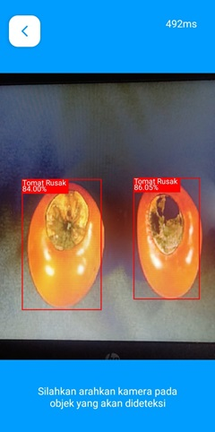
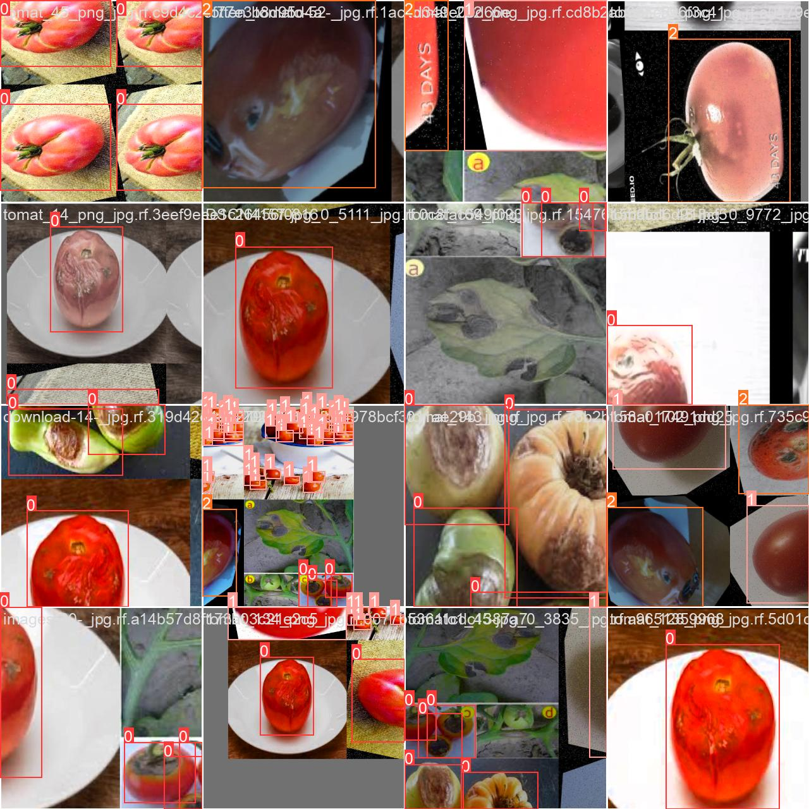
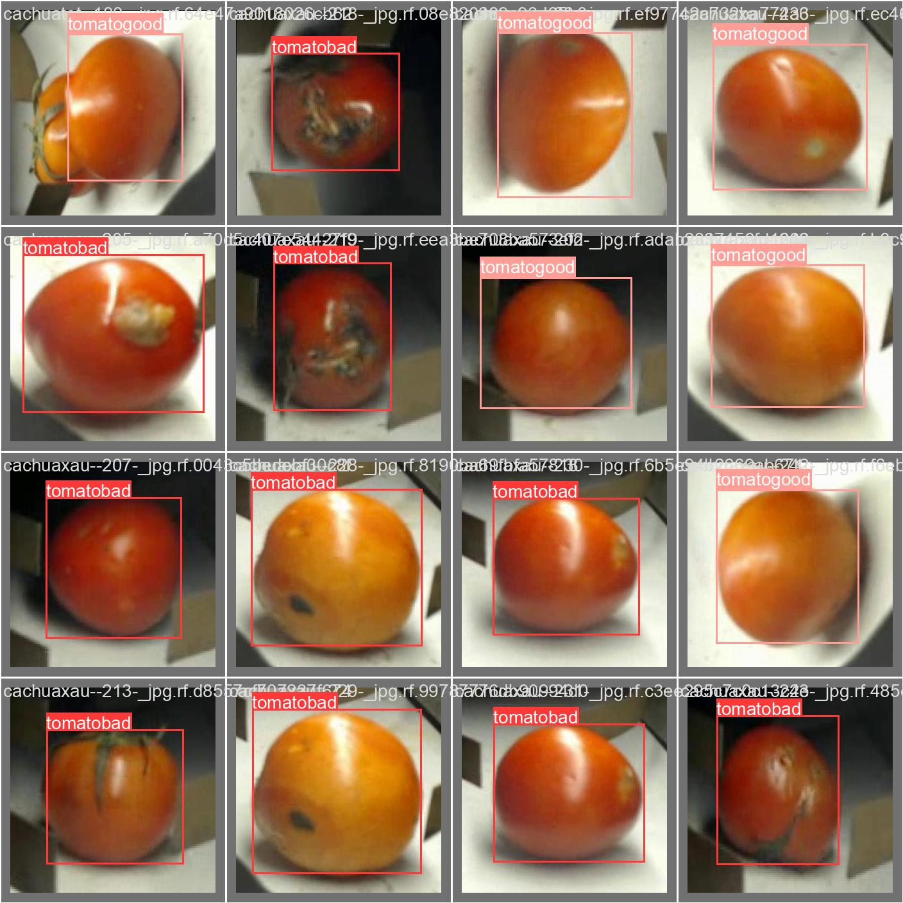
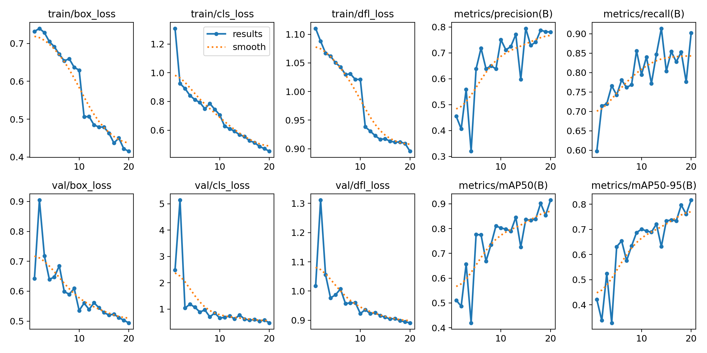

## Lafia Project

    
    

# Lafia Detector

This is an Android application that detects the defects of tomatoes using a deep learning model and computer vision. The model is based on transfer learning with YOLOv8 and has been trained on a custom dataset from Roboflow.

## Download

The application can be downloaded from the following link:

[Download Lafia Detector APK](https://drive.google.com/file/d/1XTaKibZQVaXQsfYLlI8x4MWIeA6F8Spf/view?usp=sharing)

## Features

- Detects the defects of tomatoes in real-time using the camera.
- Provides a defect score to help users make informed decisions.
- Easy-to-use interface with clear instructions.

## Dataset

The dataset was obtained from Roboflow and consists of 2452 images with 2 classes. The dataset can be accessed from the following link:

[Roboflow Dataset](https://universe.roboflow.com/hanoi-university-of-industry-xfhdu/tomato-frsnq)

## Model Training

The model was trained using transfer learning with YOLOv8 on a custom dataset from Roboflow. Once trained, the custom YOLOv8 model was converted to TensorFlow Lite for deployment on Android.

## Result

     
  "train_batch0" refers to a subset of the training data used in one iteration of the training process. During training, the model updates its parameters based on the information in this batch. Training on batches rather than the entire dataset at once helps manage memory usage and can speed up the learning process.

    
 "val_batch0" refers to a subset of the validation data used during the evaluation phase of training. Unlike the training batch, which is used to update the model's parameters, the val batch helps assess the model's performance and generalization ability on unseen data. This evaluation helps ensure that the model is not overfitting and can make accurate predictions on new, unseen data.

     
 "result" generally refers to the output generated by a machine learning model after it processes input data. This output can take various forms depending on the type of problem being solved

    

## License

This project is licensed under the MIT License - see the [LICENSE](LICENSE) file for details.

## Acknowledgements

- [YOLOv8](https://github.com/ultralytics/ultralytics) for the object detection framework.
- [Roboflow](https://roboflow.com/) for the custom dataset and tools.
- The contributors who made this project possible.

## Contact

Creator 
Muhammad Ijlal Senja Pratama 

Program Studi Teknik Industri Pertanian Universitas Linggabuana PGRI Sukabumi

If you have any questions or suggestions, feel free to open an issue or contact us at [ijlalpratama97@gmail](ijlalpratama97@gmail.com).

